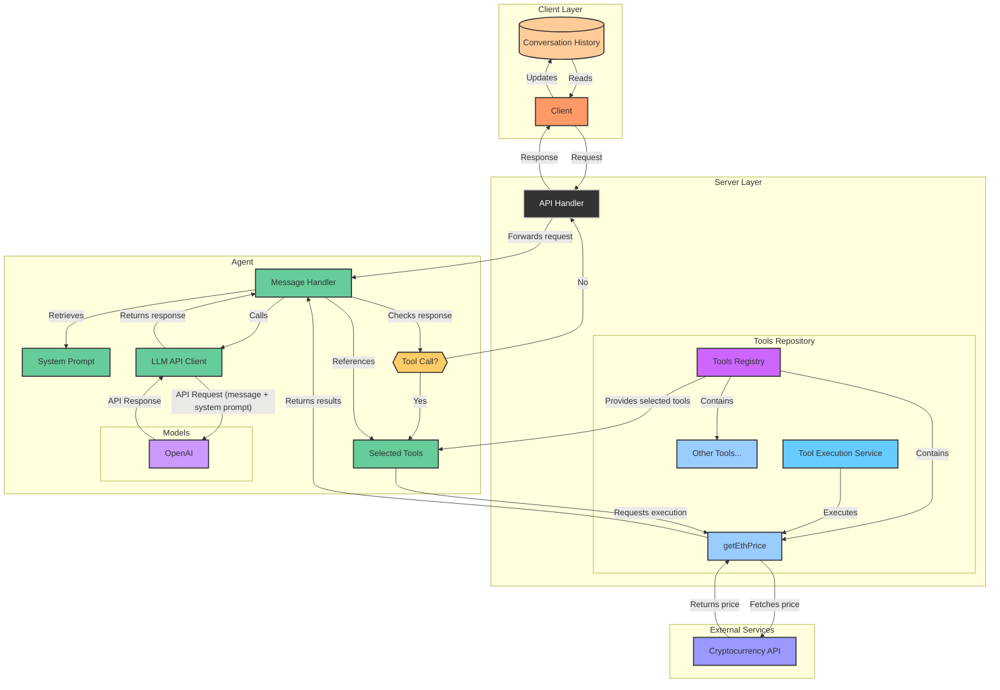

```mermaid
graph TD
    subgraph Client Layer
        ConversationHistory[("Conversation History")]
        Client
        Client -- "Updates" --> ConversationHistory
        ConversationHistory -- "Reads" --> Client
    end

    subgraph Server Layer
        APIHandler["API Handler"]
        
        subgraph Tools Repository
            ToolsRegistry["Tools Registry"]
            GetEthPrice["getEthPrice"]
            OtherTools["Other Tools..."]
            ToolExecutionService["Tool Execution Service"]
            
            ToolsRegistry -- "Contains" --> GetEthPrice
            ToolsRegistry -- "Contains" --> OtherTools
            ToolExecutionService -- "Executes" --> GetEthPrice
        end
    end
    
    subgraph Agent
        MessageHandler["Message Handler"]
        SystemPrompt["System Prompt"]
        LLMClient["LLM API Client"]
        SelectedTools["Selected Tools"]
        ToolCallTest{{"Tool Call?"}}
        
        subgraph Models
            OpenAI["OpenAI"]
        end
        
        MessageHandler -- "Retrieves" --> SystemPrompt
        MessageHandler -- "Calls" --> LLMClient
        LLMClient -- "API Request (message + system prompt)" --> OpenAI
        OpenAI -- "API Response" --> LLMClient
        LLMClient -- "Returns response" --> MessageHandler
        MessageHandler -- "Checks response" --> ToolCallTest
        ToolCallTest -- "Yes" --> SelectedTools
        ToolCallTest -- "No" --> APIHandler
        MessageHandler -- "References" --> SelectedTools
        SelectedTools -- "Requests execution" --> GetEthPrice
        GetEthPrice -- "Returns results" --> MessageHandler
    end

    Client -- "Request" --> APIHandler
    APIHandler -- "Forwards request" --> MessageHandler
    APIHandler -- "Response" --> Client
    ToolsRegistry -- "Provides selected tools" --> SelectedTools

    subgraph External Services
        CoinAPI["Cryptocurrency API"]
        GetEthPrice -- "Fetches price" --> CoinAPI
        CoinAPI -- "Returns price" --> GetEthPrice
    end

    classDef clientStyle fill:#f96,stroke:#333,stroke-width:2px;
    classDef serverStyle fill:#333,stroke:#ccc,stroke-width:2px,color:#fff;
    classDef externalStyle fill:#99f,stroke:#333,stroke-width:2px;
    classDef historyStyle fill:#fc9,stroke:#333,stroke-width:2px;
    classDef agentStyle fill:#6c9,stroke:#333,stroke-width:2px;
    classDef toolStyle fill:#9cf,stroke:#333,stroke-width:2px;
    classDef modelStyle fill:#c9f,stroke:#333,stroke-width:2px;
    classDef repositoryStyle fill:#c6f,stroke:#333,stroke-width:2px;
    classDef executionStyle fill:#6cf,stroke:#333,stroke-width:2px;
    classDef decisionStyle fill:#fc6,stroke:#333,stroke-width:2px;


    class Client clientStyle;
    class APIHandler serverStyle;
    class MessageHandler,SystemPrompt,LLMClient,SelectedTools agentStyle;
    class GetEthPrice,OtherTools toolStyle;
    class OpenAI modelStyle;
    class CoinAPI externalStyle;
    class ConversationHistory historyStyle;
    class ToolsRegistry repositoryStyle;
    class ToolExecutionService executionStyle;
    class ToolCallTest decisionStyle;
```