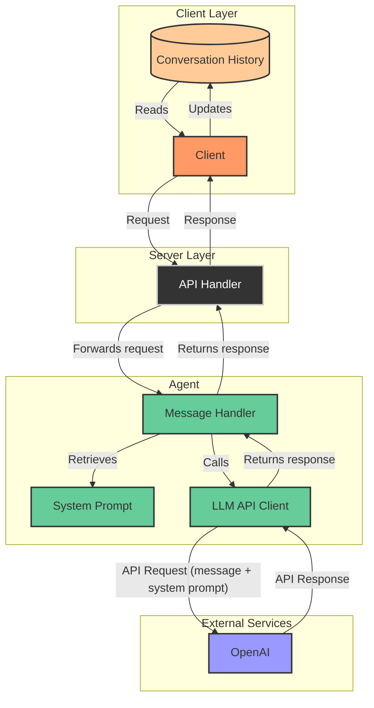

```mermaid
graph TD
    subgraph Client Layer
        ConversationHistory[("Conversation History")]
        Client
        Client -- "Updates" --> ConversationHistory
        ConversationHistory -- "Reads" --> Client
    end

    subgraph Server Layer
        APIHandler["API Handler"]
    end
    
    subgraph Agent
        MessageHandler["Message Handler"]
        SystemPrompt["System Prompt"]
        LLMClient["LLM API Client"]
        
        MessageHandler -- "Retrieves" --> SystemPrompt
        MessageHandler -- "Calls" --> LLMClient
        LLMClient -- "Returns response" --> MessageHandler
    end

    Client -- "Request" --> APIHandler
    APIHandler -- "Forwards request" --> MessageHandler
    LLMClient -- "API Request (message + system prompt)" --> OpenAI
    OpenAI -- "API Response" --> LLMClient
    MessageHandler -- "Returns response" --> APIHandler
    APIHandler -- "Response" --> Client

    subgraph External Services
        OpenAI
    end

    classDef clientStyle fill:#f96,stroke:#333,stroke-width:2px;
    classDef serverStyle fill:#333,stroke:#ccc,stroke-width:2px,color:#fff;
    classDef externalStyle fill:#99f,stroke:#333,stroke-width:2px;
    classDef historyStyle fill:#fc9,stroke:#333,stroke-width:2px;
    classDef agentStyle fill:#6c9,stroke:#333,stroke-width:2px;

    class Client clientStyle;
    class APIHandler serverStyle;
    class MessageHandler,SystemPrompt,LLMClient agentStyle;
    class OpenAI externalStyle;
    class ConversationHistory historyStyle;
```