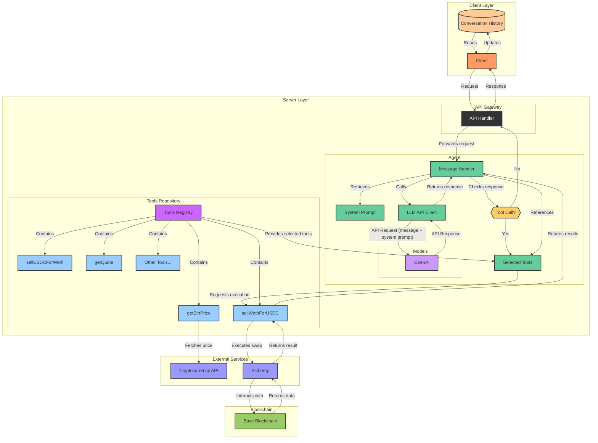

```mermaid
graph TD
    subgraph Client Layer
        ConversationHistory[("Conversation History")]
        Client
        Client -- "Updates" --> ConversationHistory
        ConversationHistory -- "Reads" --> Client
    end


    subgraph Server Layer
        subgraph API Gateway
            APIHandler["API Handler"]
        end

        subgraph Agent
            MessageHandler["Message Handler"]
            SystemPrompt["System Prompt"]
            LLMClient["LLM API Client"]
            SelectedTools["Selected Tools"]
            ToolCallTest{{"Tool Call?"}}
            
            subgraph Models
                OpenAI["OpenAI"]
            end
            
            MessageHandler -- "Retrieves" --> SystemPrompt
            MessageHandler -- "Calls" --> LLMClient
            LLMClient -- "API Request (message + system prompt)" --> OpenAI
            OpenAI -- "API Response" --> LLMClient
            LLMClient -- "Returns response" --> MessageHandler
            MessageHandler -- "Checks response" --> ToolCallTest
            ToolCallTest -- "Yes" --> SelectedTools
            ToolCallTest -- "No" --> APIHandler
            MessageHandler -- "References" --> SelectedTools
        end
        
        subgraph Tools Repository
            %% Elements
            ToolsRegistry["Tools Registry"]
            GetEthPrice["getEthPrice"]
            SellWethForUSDC["sellWethForUSDC"]
            SellUSDCForWeth["sellUSDCForWeth"]
            GetQuote["getQuote"]
            OtherTools["Other Tools..."]
            SelectedTools["Selected Tools"]

            %% Flow
            SelectedTools -- "Requests execution" --> SellWethForUSDC
            SellWethForUSDC -- "Returns results" --> MessageHandler

            ToolsRegistry -- "Contains" --> GetEthPrice
            ToolsRegistry -- "Contains" --> SellWethForUSDC
            ToolsRegistry -- "Contains" --> SellUSDCForWeth
            ToolsRegistry -- "Contains" --> GetQuote
            ToolsRegistry -- "Contains" --> OtherTools
        end
    end

    Client -- "Request" --> APIHandler
    APIHandler -- "Forwards request" --> MessageHandler
    APIHandler -- "Response" --> Client
    ToolsRegistry -- "Provides selected tools" --> SelectedTools


    subgraph Blockchain
        Base["Base Blockchain"]
    end

    subgraph External Services
        CoinAPI["Cryptocurrency API"]
        Alchemy["Alchemy"]
        
        GetEthPrice -- "Fetches price" --> CoinAPI
        
        SellWethForUSDC -- "Executes swap" --> Alchemy
        Alchemy -- "Interacts with" --> Base
        Base -- "Returns data" --> Alchemy
        Alchemy -- "Returns result" --> SellWethForUSDC
    end

    classDef clientStyle fill:#f96,stroke:#333,stroke-width:2px;
    classDef serverStyle fill:#333,stroke:#ccc,stroke-width:2px,color:#fff;
    classDef externalStyle fill:#99f,stroke:#333,stroke-width:2px;
    classDef historyStyle fill:#fc9,stroke:#333,stroke-width:2px;
    classDef agentStyle fill:#6c9,stroke:#333,stroke-width:2px;
    classDef toolStyle fill:#9cf,stroke:#333,stroke-width:2px;
    classDef modelStyle fill:#c9f,stroke:#333,stroke-width:2px;
    classDef repositoryStyle fill:#c6f,stroke:#333,stroke-width:2px;
    classDef decisionStyle fill:#fc6,stroke:#333,stroke-width:2px;
    classDef blockchainStyle fill:#9c6,stroke:#333,stroke-width:2px;


    class Client clientStyle;
    class APIHandler serverStyle;
    class MessageHandler,SystemPrompt,LLMClient,SelectedTools agentStyle;
    class GetEthPrice,OtherTools,SellWethForUSDC,SellUSDCForWeth,GetQuote toolStyle;
    class OpenAI modelStyle;
    class CoinAPI,Alchemy externalStyle;
    class ConversationHistory historyStyle;
    class ToolsRegistry repositoryStyle;
    class ToolCallTest decisionStyle;
    class Base blockchainStyle;
```