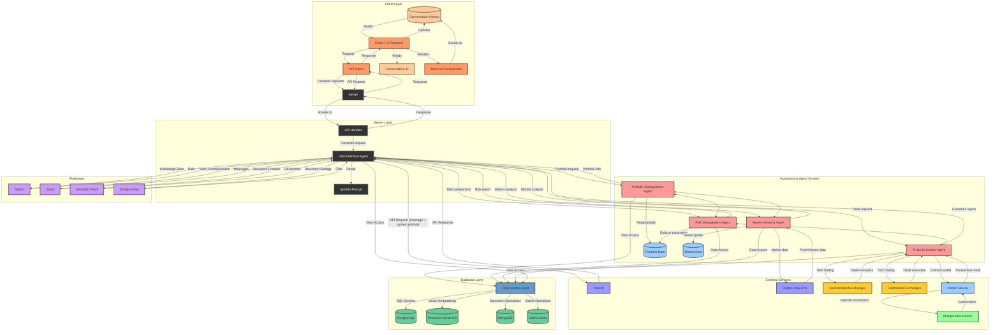

```mermaid
graph TD
    subgraph Client Layer
        ConversationHistory[("Conversation History")]
        Client["Client / UI Renderer"]
        APIClient["API Client"]
        ConversationId["Conversation ID"]
        MicroUI["Micro UI Components"]
        
        Client -- "Reads" --> ConversationId
        Client -- "Updates" --> ConversationHistory
        ConversationHistory -- "Reads" --> Client
        Client -- "Renders" --> MicroUI
        MicroUI -- "Based on" --> ConversationHistory
        APIClient -- "Forwards requests" --> Server
    end

    subgraph Server Layer
        Server["Server"]
        APIHandler["API Handler"]
        UIAgent["User Interface Agent"]
        SystemPrompt["System Prompt"]
        
        Server -- "Routes to" --> APIHandler
        APIHandler -- "Forwards request" --> UIAgent
        UIAgent -- "Reads" --> SystemPrompt
    end

    subgraph Autonomous Agent System
        PortfolioAgent["Portfolio Management Agent"]
        RiskAgent["Risk Management Agent"]
        MarketAgent["Market Analysis Agent"]
        TradeAgent["Trade Execution Agent"]
        
        PortfolioData[("Portfolio Data")]
        MarketData[("Market Data")]
        
        UIAgent -- "Portfolio request" --> PortfolioAgent
        PortfolioAgent -- "Portfolio info" --> UIAgent
        
        UIAgent -- "Risk assessment" --> RiskAgent
        RiskAgent -- "Risk report" --> UIAgent
        
        UIAgent -- "Market analysis" --> MarketAgent
        MarketAgent -- "Market analysis" --> UIAgent
        
        UIAgent -- "Trade request" --> TradeAgent
        TradeAgent -- "Execution report" --> UIAgent
        
        PortfolioAgent -- "Read/Update" --> PortfolioData
        RiskAgent -- "Enforce constraints" --> PortfolioData
        MarketAgent -- "Read/Update" --> MarketData
        
        PortfolioAgent <--> RiskAgent
        PortfolioAgent <--> MarketAgent
        RiskAgent <--> TradeAgent
    end

    subgraph External Services
        OpenAI
        CryptoAPIs["Crypto Data APIs"]
        DEXs["Decentralized Exchanges"]
        CEXs["Centralized Exchanges"]
        WalletService["Wallet Service"]
        Blockchain["Multiple Blockchains"]
    end

    subgraph Database Layer
        DataAccessLayer["Data Access Layer"]
        PostgreSQL[("PostgreSQL")]
        Pinecone[("Pinecone Vector DB")]
        MongoDB[("MongoDB")]
        Redis[("Redis Cache")]
        
        DataAccessLayer -- "SQL Queries" --> PostgreSQL
        DataAccessLayer -- "Vector Embeddings" --> Pinecone
        DataAccessLayer -- "Document Operations" --> MongoDB
        DataAccessLayer -- "Cache Operations" --> Redis
    end

    subgraph Workplace
        Notion["Notion"]
        Slack["Slack"]
        MicrosoftWord["Microsoft Word"]
        GoogleDrive["Google Drive"]
        
        UIAgent -- "Knowledge Base" --> Notion
        UIAgent -- "Team Communication" --> Slack
        UIAgent -- "Document Creation" --> MicrosoftWord
        UIAgent -- "Document Storage" --> GoogleDrive
        
        Notion -- "Data" --> UIAgent
        Slack -- "Messages" --> UIAgent
        MicrosoftWord -- "Documents" --> UIAgent
        GoogleDrive -- "Files" --> UIAgent
    end

    Client -- "Request" --> APIClient
    APIClient -- "API Request" --> Server
    UIAgent -- "API Request (message + system prompt)" --> OpenAI
    OpenAI -- "API Response" --> UIAgent
    
    MarketAgent -- "Market data" --> CryptoAPIs
    CryptoAPIs -- "Price/Volume data" --> MarketAgent
    
    TradeAgent -- "DEX trading" --> DEXs
    TradeAgent -- "CEX trading" --> CEXs
    DEXs -- "Trade execution" --> TradeAgent
    CEXs -- "Trade execution" --> TradeAgent
    
    TradeAgent -- "Connect wallet" --> WalletService
    WalletService -- "Execute transaction" --> Blockchain
    Blockchain -- "Confirmation" --> WalletService
    WalletService -- "Transaction result" --> TradeAgent
    
    APIHandler -- "Response" --> Server
    Server -- "Response" --> APIClient
    APIClient -- "Response" --> Client

    PortfolioAgent -- "Data Access" --> DataAccessLayer
    RiskAgent -- "Data Access" --> DataAccessLayer
    MarketAgent -- "Data Access" --> DataAccessLayer
    TradeAgent -- "Data Access" --> DataAccessLayer
    UIAgent -- "Data Access" --> DataAccessLayer

    classDef clientStyle fill:#f96,stroke:#333,stroke-width:2px;
    classDef serverStyle fill:#333,stroke:#ccc,stroke-width:2px,color:#fff;
    classDef externalStyle fill:#99f,stroke:#333,stroke-width:2px;
    classDef historyStyle fill:#fc9,stroke:#333,stroke-width:2px;
    classDef agentStyle fill:#f99,stroke:#333,stroke-width:2px;
    classDef dataStyle fill:#9cf,stroke:#333,stroke-width:2px;
    classDef walletStyle fill:#9cf,stroke:#333,stroke-width:2px;
    classDef blockchainStyle fill:#9f9,stroke:#333,stroke-width:2px;
    classDef exchangeStyle fill:#fc3,stroke:#333,stroke-width:2px;
    classDef databaseStyle fill:#6c9,stroke:#333,stroke-width:2px;
    classDef dataLayerStyle fill:#69c,stroke:#333,stroke-width:2px;
    classDef workplaceStyle fill:#c9f,stroke:#333,stroke-width:2px;

    class Client,APIClient,MicroUI clientStyle;
    class Server,APIHandler,UIAgent,SystemPrompt serverStyle;
    class OpenAI,CryptoAPIs externalStyle;
    class ConversationHistory,ConversationId historyStyle;
    class PortfolioAgent,RiskAgent,MarketAgent,TradeAgent agentStyle;
    class PortfolioData,MarketData dataStyle;
    class WalletService walletStyle;
    class Blockchain blockchainStyle;
    class DEXs,CEXs exchangeStyle;
    class PostgreSQL,Pinecone,MongoDB,Redis databaseStyle;
    class DataAccessLayer dataLayerStyle;
    class Notion,Slack,MicrosoftWord,GoogleDrive workplaceStyle; 
```